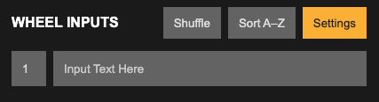
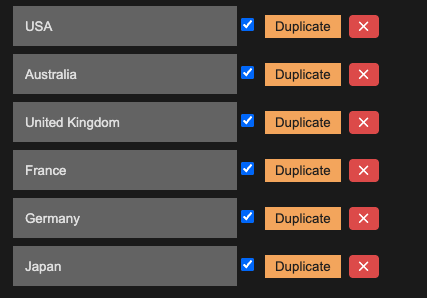
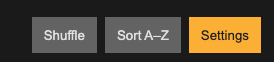
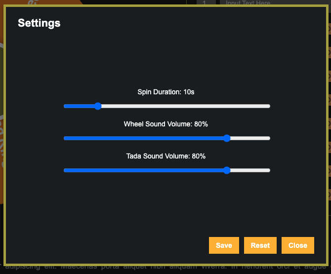
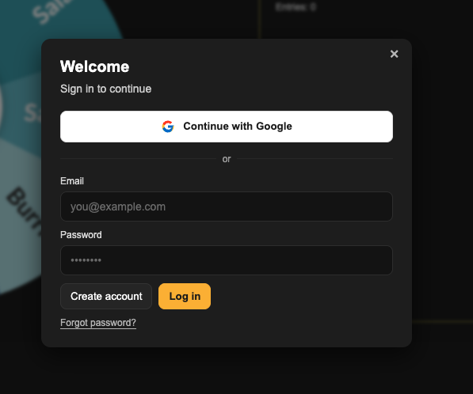
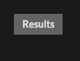
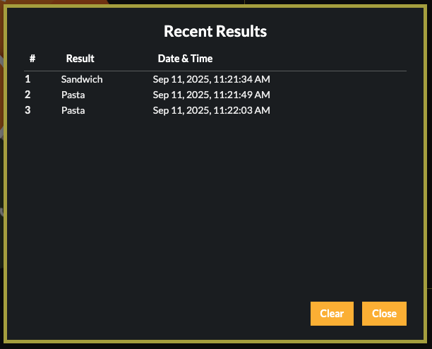

## **1\. What Is Picker Wheel?**

A fashionable wheel spinner that can be customized and has multiple functions. Simply enter your information, spin the wheel, and receive your random outcome.

Sometimes our brains simply aren't able to make decisions, so why not allow the wheel spinner make the little choice?

Simply enter your information and spin the wheel to get a random outcome right away.

The wheel spinner's sophisticated algorithm will provide you with the most equitable outcome.

The technology is frequently used for remote events, raffles, instruction, and many more purposes.

The Picker Wheel characteristics are explained in detail in the sections that follow.

## **2\. How to Use This Spinner?**

Picker Wheel is a quick and simple random picker that only requires three basic actions. Enter data, turn the wheel, and see the outcome. It contains a lot of features that make making decisions enjoyable.

Picker Wheel is incredibly user-friendly. The few steps to use the spinner to select a random decision are listed below.

* Add inputs such as text or images. You can combine the two.

* Using the plus button or return key on your device, enter the text input one at a time.

* Click the image input button to insert the image.

    

* The input lists are shown. Changes to the input's value, position, duplication, hiding, and deletion are still possible. Each entry can have both text and an image. The wheel spinner will immediately display all of these modifications.

    

* The spinning wheel can be started by pressing the "Ctrl \+ Enter" keys or by clicking the Spin button on the random wheel.

    

* After the wheel spins, the Picker Wheel indicates the picked option where its pointer points.

* For the specified option, pick one of the action modes. To switch, select, or close operations, you can also use the keyboard keys Tab, Enter, and Esc.

    

* The Inputs section has four function buttons.

    

* Hide inputs section button: This button allows everyone to concentrate on the wheel by hiding the inputs to the side.

* Before spinning the wheel, press the "shuffle" button to cycle through all of the entries.

* A list of text inputs can be added more quickly with the View/import inputs button. Another way to import is to upload an Excel file in.csv format. Additionally, all of your previous inputs are visible and accessible via copy-paste.

* Numerous other features, such enabling weight and altering the title, are available via the "More" button.

    

Here are the fundamentally easy steps to use the wheel spinner. There are still a ton of fantastic things that you may utilize, so please keep reading.

## **3\. Wheel Customization?**

The wheel can be customized or configured in a variety of ways to meet your needs.

The Tool Settings area (below the wheel section) is where you can do it. The Tool Settings can be found here: (Click it to make it enlarge.)

The configuration options are as follows:

* Behavior of Spin  
* Speed of spinning (level 1 to level 10).  
* Duration of spinning (1s to 30s).  
* Turn on the manual stop button.  
* Mystery spin (substitute "?" for wheel inputs)  
* number of spins  
* arbitrary starting angle.  
* First spinning  
* Sound and Confetti  
* Turn on or off the confetti.  
* Turn the sound on or off.  
* Personalize the opening, rotating, and closing noises.  
* Tool Colors: Select from a variety of themes to alter the wheel's color.  
* backdrop Color: Modify the section's overall backdrop color.  
* backdrop Image: Include a backdrop image at the part with the wheels. (Users of Premium)  
* Create your own spin button by personalizing it. (Users of Premium)  
* Banner | Logo: You may add your own banner or logo here. (Users of Premium)

\* Personalize the wheel by adding your own backdrop color, wheel noises, and colors. (Users of Premium)

## **4\. File Storage \- How to Save/Open/Delete File?**

The inputs with the most recent status will be automatically saved in the storage of your browser by default for all users. Therefore, when you return using the same browser, you may still access the same data. Please be aware that clearing the browser's history or overloading its memory may cause the data to be lost.

You can store more lists in the Picker Wheel cloud storage. Only those that are logged in can use this. The process of creating an account is free. To sign up, click the menu button in the upper right corner of the page.

The advantages of file storage are greater for users who are logged in.

* More than one file can be saved. (Free Users can access up to 15 files, while Premium Users can access up to 100.)  
* Any device, anywhere, at any time, can access your file.  
* not having to worry about losing data and feeling at ease.

The "List" and "Share" file types are the two categories of files in Picker Wheel.

List type: This is the file type that appears once your data list has been saved. Only you have the ability to see and modify this private document.

Share type: Any private list file that you add a share link to becomes a share file, which means that only you can update it but that others can view and copy it. Converting a List file to a Share file is an irreversible operation.

### **4.1. How to Save?**

* after your data preparation is complete. Press the "File" icon. Select the option "Save List as.."  
* After selecting a file to save, give it a name. The same kind of old file can likewise be replaced. Your data with their most recent statuses will be saved. To include your current tool settings, such as tool colors, you can check the "Include current settings" box.  
* Only when you wish to replace an existing file or save new data to a new one may you select "Save List as.." After you have already saved a file, you may see the "Save" button that is ready for you to click. You can immediately save the data to the current file by clicking the "Save" button.

### **4.2. How to Open/Delete File?**

* Press the "File" button. Select the button labeled "Open/Edit File."  
* To open a file, choose it. From here, you can open and modify files of the "List" and "Share" types.  
* To remove: Select a file to remove. Here, you can remove files of the "List" and "Share" types.

## **5\. Share Wheel**

Are you aware that your friends, family, and audiences can view your random wheel with your current customizations or inputs? To find out how, see the steps below.

From the Picker Wheel website, click the "share" button located in the upper right corner.

Your inputs (statuses are not included) and title will be automatically captured by the system and added to the share link. You have the option to include "Settings" as well, which will include the colors, music, and other settings. Users will be in "Share View" when they click on your share link.

The share method will display:

* Share as Guest: This duplicates a fresh set of information according to what will be added. Once data is created, it cannot be altered by the owner. There won't be any premium customisation available. If the link is unused for 365 days or is not opened for the first time within 60 days, it is destroyed.  
* Share from File: Allow others to share your file. The data is always synchronized in real-time, and the owner can make changes at a later time. If you have premium customisation, it will be included. As long as the file is available, the link will remain active. You have the option to display your banners on the shared spinning wheel in place of the advertisements.  
* View Only: The spinner wheel can only be viewed and played.  
* may Copy: The spinner may be viewed, played, and copied.

Click "Create Share Link" once the setting is complete. You'll notice that a link is created. To share the Picker Wheel with others, you may either click the copy button or copy the link's address.

It can also be shared straight on Twitter or Facebook.

## **6\. Create New Wheel and Switch Wheel**

On the desktop version, the switch wheel button is in the header bar; on the mobile version, it is inside the file button menu.

To obtain a fresh, blank default Picker Wheel, click the "Create New Wheel" button. Up to five wheels can be produced, and you can alternate between them. You may make a wheel of names, an animal wheel, etc., for instance. \* Please remember that only the information from the wheel that is presently in use is kept for the following visit. Refreshing the page will remove all wheels except the active wheel.

## **7\. Modify Title Section**

Your audiences will understand the objective of your spin wheel if you write your own tool title, tool description, and result title.

By selecting the More Button from the Inputs section, you may modify the title.

Additionally, write the texts down for them.

While the result title will appear when the outcome is announced, as seen below, the tool title and description will appear in the upper corner.

## **8\. Enable Weight**

Every input is by default given an equal portion size in a randomizer wheel.

However, by turning on the weight, you can alter this behavior.

By turning it on, you have an additional weight field that you may fill in for each of your inputs.

Each input's portion size is determined by its weight out of the total weights, which will be calculated by adding together all of the allocated weights.

Clicking the More Button from the Inputs section will activate or disable the weight option.

## **9\. View All Results or Scores**

You can click the "Open All Results" button after the wheel has spun to examine all of your results or all of the scores (as determined by the counts).

It will display every outcome that has been left up to chance since the beginning of your current visit.

Additionally, a descending order summary of the scores from your current wheel input is displayed.

To share the results with others, click the "Open Results" button to bring up the results page.

Clicking the "Clear Results" button will remove all of the records.

## **10\. Share Results**

You can share two different types of results. One is for a single result, and the other is for every result.

* One outcome. Sharing your single result can only be done at the time of announcement. Press the "share" button.  
* Every outcome. You can generate a result link to share with others after the results page is open. On the results page, you may also download the results image.

## **11\. Full Screen View**

Additionally, you can click the full-screen button to enter or exit the full-screen view. (Only available on desktop and tablet devices.)

The inputs section will be buried and the wheel picker will increase when full-screen view is selected.

The "Open All Results" button still allows you to view your scores or outcomes.

## **12\. Types of Action Modes**

You can enter any input you like, and the spinner wheel will make the final decision. Users can select from three options to make the best decision.

### **12.1. Normal Mode**

This mode is a one-time random decision picker. When the user hits the "done" button, the randomizer wheel will reveal the outcome they have chosen. The chosen outcome won't have any negative effects, like being hidden.

#### **Use Case 1**

In a situation where it functions similarly to a digital prize wheel, this could be utilized as a random name Picker Wheel. After the wheel is spun, one winner will be selected from the list of contestants. For more involved exercises, you can also utilize the wheel in conjunction with a countdown timer.

### **12.2. Elimination Mode**

By removing each input one at a time, it alternatively chooses a random name. In the following round, the outcome will be momentarily taken off the wheel.

#### **Use Case 2**

The teacher can utilize this wheel of names in the classroom to call on each student to answer a question individually without using the same name twice.

### **12.3. Accumulation Mode**

It is a technique of accumulation of random decisions. Each chosen input's count is added up and carried over to the following spin.

#### **Use Case 3**

You can use this to choose what to eat. Instead of just spinning the wheel once to choose what to eat (a one-time outcome may make the user less convinced), this mode counts the number of options after multiple spins to persuade you to choose.

## **13\. Premium Personalized Plan**

Are you trying to find

* solution without ads?  
* additional storage for files?  
* further personalizations?  
* own banner or logo placement?  
* integrate wheel personalization?  
* help us?

You might think about switching to the Personalized plan.

## **14\. Picker Wheel Family**

A number of specialized Picker Wheel tools have been developed in addition to the primary Picker Wheel.

* Check out our Random Team Generator if you're seeking for a tool to do a random grouping.  
* You can also use our Yes or No Wheel if you need to make a decision that is only a yes or no.  
* Alternatively, you can experiment with our Random Number Generator if you explicitly want a random number output.  
* Alternatively, we have the Random Letter Generator if you would want a random letter output.  
* If you would prefer to obtain the output of a random nation, we also have the Random Country Generator available.  
* If you would want a random date output, we also have the Random Date Generator.  
* Or, if you like a Picker Wheel that is based on images, we have developed the Random Image Generator.  
* Alternatively, you can use our Random Color Generator to extract colors from photos, make color palettes, or select a random color.  
* Another option is the Random NFL Team Generator, which selects an NFL team at random from a 32-team pool.  
* Another option is the Random NBA Team Generator, which selects an NBA team at random from a pool of thirty teams.  
* Or would you like to run a campaign of Instagram prizes based on the comments? The Instagram Comment Picker is something we made.  
* We also provide an embedded Picker Wheel that you may place on your page in addition to these on-site options. To find out how to do it, you can consult the embed tutorial page.

## **15\. Save as an App in Your Device**

### **15.1. Desktop App**

Use Chrome to open the Picker Wheel. To install the app, click Settings \-\> Save and Share \-\> Install page.

It is now set up on your laptop or desktop computer. You can view it at any moment without using a browser or remembering the URL.

### **15.2. Smartphone App**

Use Chrome (Android) or Safari (iOS) to access the Picker Wheel website. Select Add to Home Screen after clicking the Settings (Android) or Share (iOS) buttons.

Set up Picker Wheel on an iOS gadget.

Set up Picker Wheel on an Android smartphone.

Your device has it installed now.

Happy Spinning\! Let's spin the wheel now\!